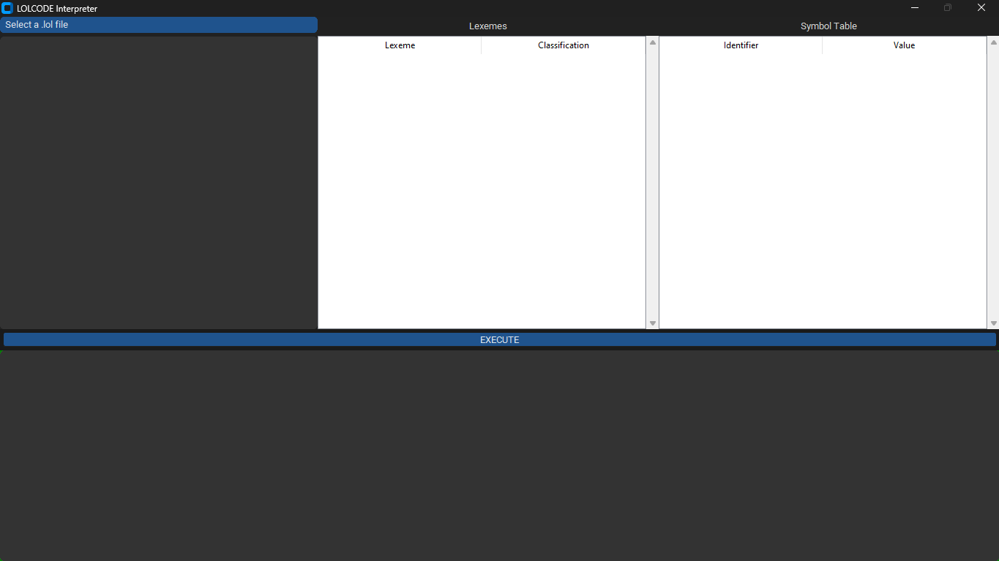
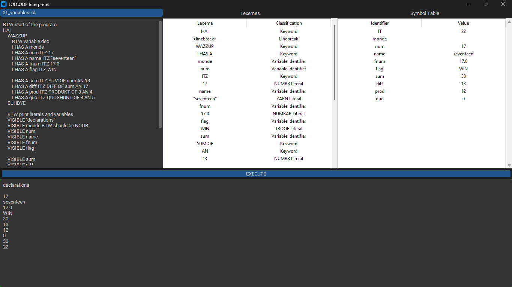

# lolcode-interpreter

A LOLCODE interpreter built using Python 3 and customtkinter, featuring a GUI for editing and executing LOLCODE programs. Developed as a coursework for CMSC 124 Design and Implementation of Programming Languages, it includes support for lexical analysis, syntax parsing, semantic analysis, and error handling.

## Table of Contents

- [lolcode-interpreter](#lolcode-interpreter)
  - [Table of Contents](#table-of-contents)
  - [Installation](#installation)
  - [Usage](#usage)
  - [Screenshots](#screenshots)
  - [License](#license)

## Installation

1. Install Python 3 (Preferably Python 3.12.4)
2. Install the dependencies in requirements.txt
   1. In your terminal, navigate to the project directory
   2. Install all the packages using the command: `pip install -r requirements.txt`

## Usage

To run the application through the terminal:

- If you have make installed, run the command: `make`
- Otherwise, run either of the following commands: `py ./source\ code/main.py` or `python ./source\ code/main.py`

## Screenshots

  

  

## License

Copyright (c) Nico De Castro. All rights reserved.

Licensed under the [MIT](LICENSE.txt) license.
